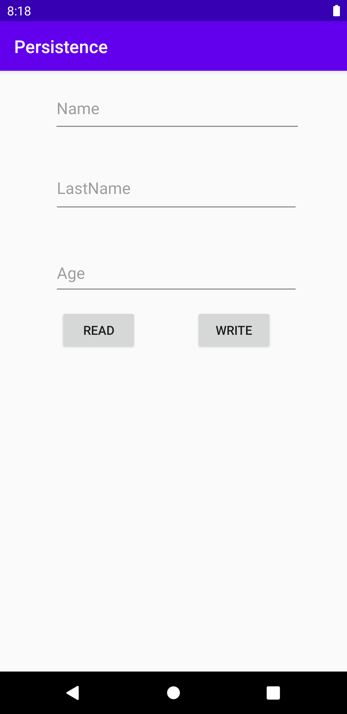
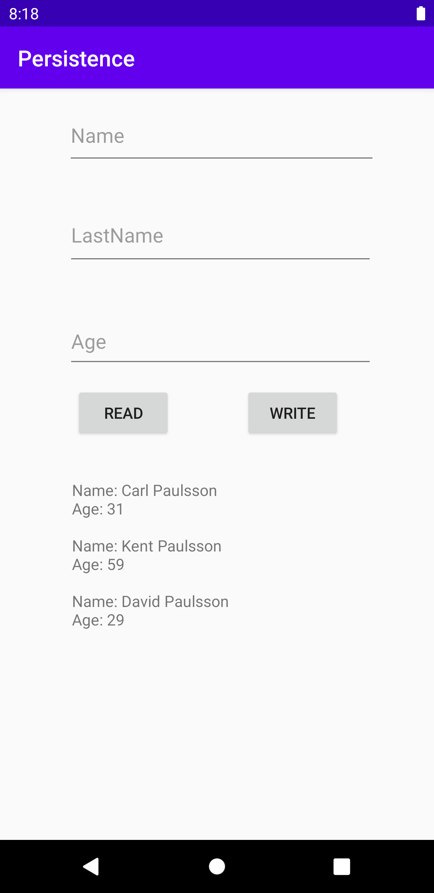

# Rapport
I den här uppgiften så har jag genom SQLite gjort så att data som skrivits in i 3 edit text fält sparas till en databas och som sen kan visas vid ett knapp tryck.
Förstå så skapade jag layouten för main aktivity, 3 edit text, 2 knappar och 1 Text View. 
Sen skapade jag en klass för att representera den data som ska spara från edit text fälten, som heter EntryItem.
Sen för att skapa själva Databasen så skapades Java classen DatabaseHelper som ärver ifrån SQLiteOpenHelper. 
Det är i denna class som Tabellerna och dess ordning framställs. Samt metoder för att lägga till och hämta den datan som läggs in, genom addOne och getAll.
Dessa metoder aktiveras genom clicklyssnare som skapas till de två knapparna, kappen döpt write kallar på addOne och read kallar på getAll.

Koden nedan visar del av metoden getAll, här skapas det en frågeställning i String, en läs referens till databasen och genom de två en cursor.
Cursorn innehåller den data som uppfyller frågeställningen utifrån databasens innehåll. I detta fall allt som den innehåller.

```
String query =  "SELECT * FROM " + ENTRY_TABLE;
SQLiteDatabase db = this.getReadableDatabase();
Cursor cursor = db.rawQuery(query, null);
```


  
